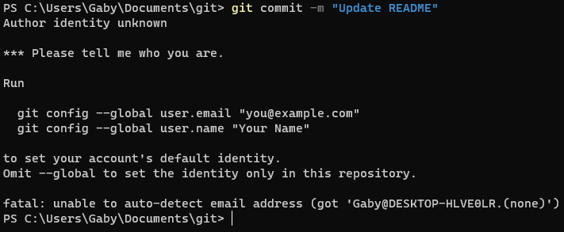

## Sommaire
- [Sommaire](#sommaire)
- [Commandes](#commandes)
- [Erreur de commit](#erreur-de-commit)

# Commandes
Légende :
- `<argument>` : L'argument est requis pour le bon fonctionnement de la commande.
- `[argument]` : L'argument est optionnel.

| Commande | Argument | Description |
| -------- | -------- | ----------- |
| `git clone <url>` | `url` : l'url du repository à cloner | Clone un repository distant sur votre pc en local. |
| `git add <file> [files...]` | `file` : le fichier à ajouter au commit. Peut être remplacer par `*` pour tout ajouter ou `.` pour ajouter uniquement les fichiers modifiés<br />`files` : les fichiers supplémentaires à ajouter au commit. | Ajoute un ou plusieurs fichier pour le prochain commit. |
| `git commit -m <text>` | `text` : Le message de votre commit. | Effectue un commit à votre repo sur la branche actuelle. |
| `git push` | | Met à jour votre repo avec le commit effectuer. |
| `git revert <hash>` | `hash` : Le hash du commit. | Annule les changements du commit donné en argument.|
| `git branch <name>` | `name` : Le nom de la branche. | Crée une nouvelle branche. |
| `git checkout <name>` | `name` : Le nom de la branche. | Selectionne la branche sur laquelle vous allez agir. |

# Erreur de commit

Vous avez très certainement déjà eu cette erreur :



Si jamais vous avez cette erreur, pas de panique. Git vous demande seulement de vous identifier pour effectuer un commit.

Pour régler ce problème, vous devez effectuer ces commandes :
```shell
> git config user.email "mon.mail@exemple.com"
> git config user.name "Mon Nom"
```
> Remplacez bien `mon.mail@exemple.com` par le mail ynov pour **Gitea** et `Mon Nom` par le nom que vous avez sur **Gitea**

> Dans l'image, Git vous met un `--global` dans la commande voulant dire que cette configuration sera pour tous vos repos par défaut.